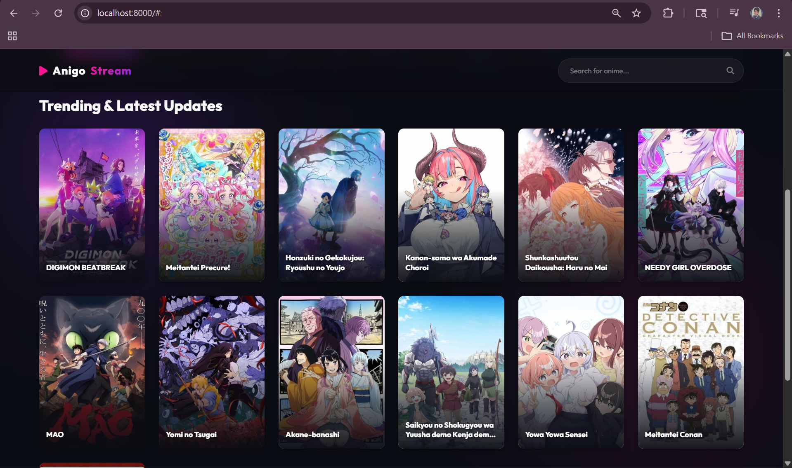
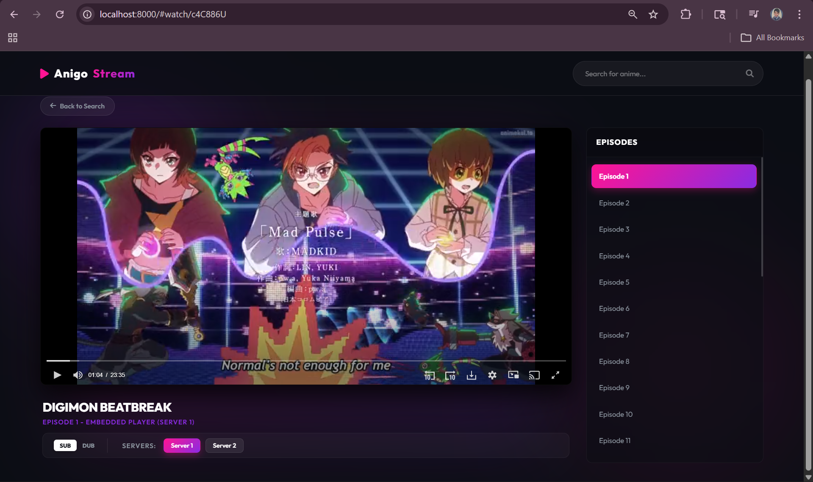

# 🎬 AnigoStream - Premium Anime Engine & Scraper

A high-performance, **reverse-engineered** anime scraping engine, REST API, and Premium Frontend for **Anigo.to**. This project features advanced decryption logic to bypass Cloudflare security, resolve direct M3U8 streaming links, and includes an intelligent auto-fallback frontend player.

---

<p align="center">
  
  <br>
  <i>Home Dashboard with Cinematic Hero Banner</i>
</p>

<p align="center">
  
  <br>
  <i>Premium Watch Page with Server Switching & Auto-Fallback</i>
</p>


https://github.com/user-attachments/assets/fa111952-7337-4b35-bf75-1cc5a7aec039


---

## ✨ Key Features

- **🚀 Cloudflare Bypass:** Built with `curl_cffi` to seamlessly emulate browser signatures and bypass strict 403 Forbidden/Cloudflare blocks.
- **⚡ Smart Server Fallback:** The premium UI automatically tests server links (Megacloud / Vidstream) and instantly skips dead links (404s).
- **🌐 Dual-Language UI:** Seamless toggle between **SUB** and **DUB** via intelligent UI buttons that automatically disable if a track is unavailable.
- **🛡️ Direct M3U8 Resolution:** Reverse-engineered decryption logic (`Kai` and `Mega` algorithms) to extract raw video sources from external providers.
- **📱 Premium Glassmorphism UI:** Complete frontend included with a dynamic Hero Banner, interactive Server Selector, and cinematic video player.
- **🧠 Advanced Caching:** Persistent JSON-based cache (`cache_anigo_bypass.json`) with configurable TTL for ultra-fast 0ms response times.

---

## 🛠️ Technology Stack

- **Backend Framework:** Python 3.x, Flask (REST API)
- **Scraping Engine:** BeautifulSoup4, `curl_cffi` (Impersonation Engine)
- **Security Logic:** Custom Decryption Layer (AES-based reverse engineering)
- **Frontend Stack:** HTML5, CSS3 (Vanilla Glassmorphism), Vanilla JavaScript, Native Iframe Embeds

---

## 🚀 Quick Start

For a seamless 1-click boot of the entire stack (Backend + Frontend), simply run the included shortcut:

1. Double-click **`run_anigo.bat`**
   - *It will automatically install missing dependencies (like `curl_cffi`).*
   - *It starts the API on Port `5002`.*
   - *It starts the Frontend on Port `8000`.*
   - *It opens your default browser.*

To install dependencies manually:
```bash
pip install -r requirements_anigo.txt
```

---

## 🚀 API Endpoints (Port 5002)

### 🏠 API Root
> **GET** `/`  
> Health check and version metadata.
```http
http://localhost:5002/
```

### 📺 Home Dashboard
> **GET** `/api/home`  
> Returns latest updates and trending anime straight from the Anigo homepage.
```http
http://localhost:5002/api/home
```

### 🔍 Global Search
> **GET** `/api/search?keyword={query}`  
> Search for any anime with detailed stats.
```http
http://localhost:5002/api/search?keyword=jujutsu
```

### 📜 Episode List
> **GET** `/api/episodes/{ani_id}`  
> Full list of episodes with secure tokens.
```http
http://localhost:5002/api/episodes/12345
```

### 🖥️ Server List
> **GET** `/api/servers/{ep_token}`  
> Lists available stream links (Server 1, Server 2) and language support flags.
```http
http://localhost:5002/api/servers/xyzToken123
```

### ⚡ Direct Resolver
> **GET** `/api/source/{link_id}`  
> **The Core Resolver:** Decrypts and returns direct M3U8 links & skip-times from providers like Megacloud and Vidstream.
```http
http://localhost:5002/api/source/abcLinkId789
```

---

## 🎨 UI Architecture (`anigo_web`)

The project includes a standalone modular frontend:
- **`app.js`**: Core state management, routing (Search -> Watch), dynamic DOM injection, and intelligent Server Fallback logic (`playServer()`).
- **`style.css`**: Advanced UI styling featuring custom scrollbars, animated buttons, soft glowing shadows, and grid layouts.
- **`index.html`**: Clean semantic HTML structure using modular `<section>` views.

---

*Engineered with precision to ensure stable, ad-free streaming.*
